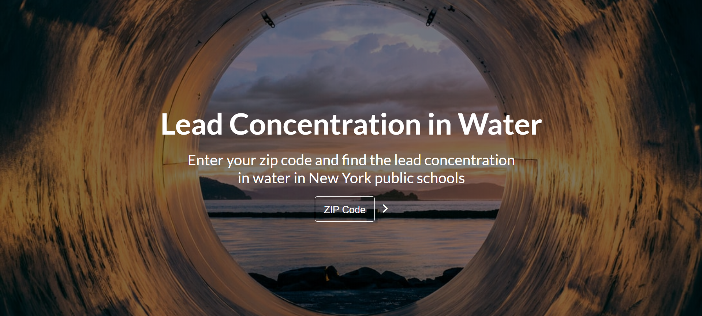
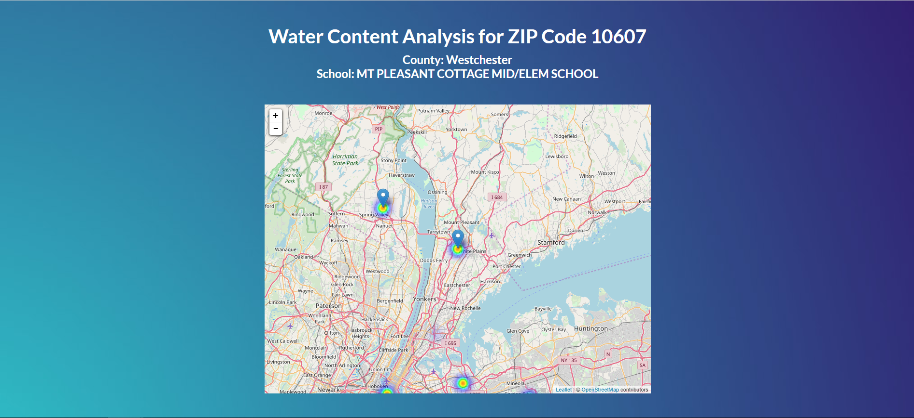
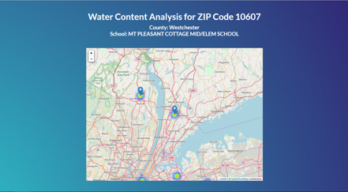
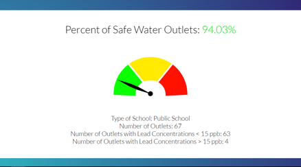
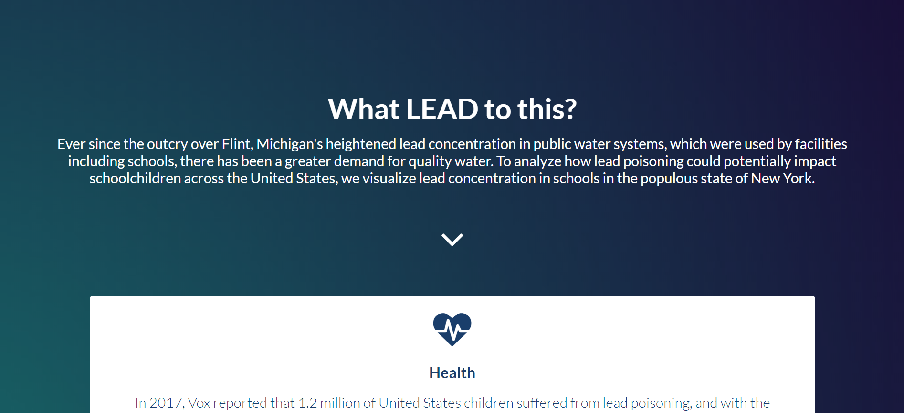

# Web PB
## Overview
OmniHacks 2019 - Best Website, Top 10 Overall
When lead permeates public water systems, children are directly put at risk. In analyzing the lead concentration of drinking water in New York public schools, we hope to draw attention to this issue.

## Inspiration
After the public outcry over the government's inaction in remedying the situation in Flint, Michigan, where the public was forced to contend with lead-infused water, we wanted to continue to draw attention to this issue since it spans numerous low-income communities in the U.S. Since children are not required to be tested for lead poisoning, numerous cases go untreated. By analyzing data concerning the lead concentration of drinking water from New York public schools, we aim to illustrate how this issue can fester in a populous state.

## What it does
By entering a ZIP code, users can identify schools in their ZIP code and see the water quality of the water facilities there. The lead concentration of drinking water is displayed across numerous school districts in the state of New York so that users can comprehend the magnitude of the issue and compare the quality of water in their area as compared to neighboring ZIP codes.

## How we built it
Using HTML and CSS, we constructed the static form of the website. Then, we used PHP to extract information from a large CSV file that contained all of the survey data. We then used the data to identify descriptive characteristics, which we displayed numerically and graphically and then provided further information about the extent of this issue for interested users.

## Challenges we ran into
We initially struggled with implementing the Heatmap that depicts the quality of water across several school districts. In converting the data from a CSV into a usable array, we began by using Google Fusion Tables, but transitioned to using a Leaflet heatmap plugin and were able to properly visualize individual data points with respect to the entire dataset.

## Accomplishments that we're proud of
Converting a large CSV file into a usable array presented a challenge, but by being able to successfully make this conversion and display the data accurately and efficiently, we are glad to have analyzed this data well. Additionally, the Heatmap that illustrates the distribution of data points required much precision and a thorough trial and error process and so we are proud to have completed it.

## What we learned
Using several languages with different capabilities can present a challenge, especially when one is obsolete compared to another. We also learned to research possible alternatives to certain APIs or services when they proved to be incompatible with the framework of our product.

## What's next
We hope to implement a mechanical aspect to our project so that users can test drinking water themselves and contribute to a collective dataset shared by schools nationwide. We also hope to analyze the drinking water in other states as well and identify a correlation between socioeconomic status and quality of drinking water.

## Built with
HTML, CSS, PHP, JavaScript, Leaflet.js 
Data obtained from <a href="https://healthdata.gov/dataset/lead-testing-school-drinking-water-sampling-and-results-most-recently-reported-beginning">Lead Testing in School Drinking Water</a>, a survey conducted by the Department of Health. 
Components of this website include a heatmap plugin from Leaflet, which can be found <a href="https://github.com/Leaflet/Leaflet.heat">here</a>
DevPost link for the OmniHacks hackathon <a href= "https://devpost.com/software/analyzing-lead-concentration-in-school-drinking-water?ref_content=contribution-prompt&ref_feature=engagement&ref_medium=email&utm_campaign=contribution-prompt&utm_content=contribution_reminder&utm_medium=email&utm_source=transactional#app-team">here</a>.

